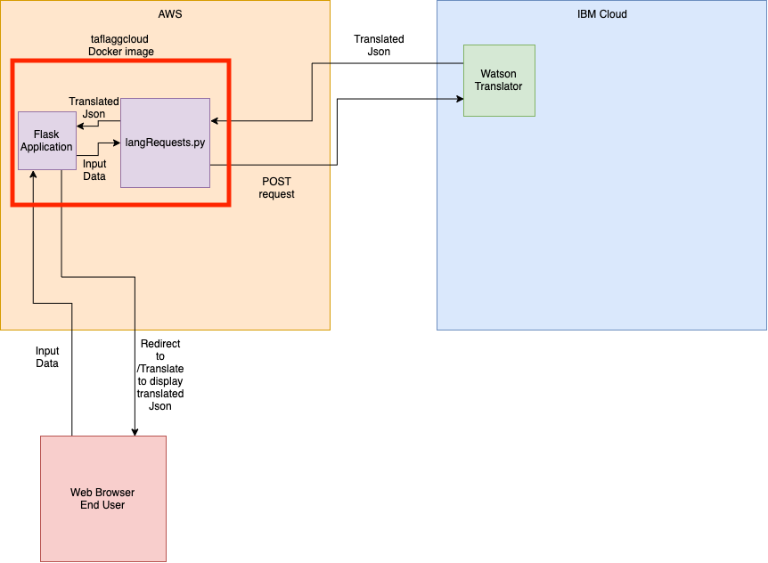

# marist-mscs621-2019-TroyFlagg
# Translation of languages
This application can take in api keys and end points provided by watson language translator [here] (https://www.ibm.com/watson/services/language-translator/)
Upon providing keys, and specified languages you can click on the translate button to be redirected to a page displaying the json return providing translated text, number of words and number of characters. 

# Running
There are three ways to run 
## As a python script
You can simply clone this repo then run `python app.py` to start your flask server.

## As a Docker container
You will need to build a docker image with the provided Dockerfile with the following command 

`docker build . -t tagname`. 

Once the image is built you can run an instance of it as a container with the following command 

`docker run -p <port>:<port> tagname`

## Accessing the application running on AWS
Simply navigate to where the app is running on AWS at the following link 3.16.48.2:5000 NOTE: This will be taken down by the end of 2019. 

# Architecture
There are three key components of this app detailed in the architecture diagram below. 

## langRequests
This script contains a python class Watson_Translator which is created to handle the requests to and from Watson Language Translator. 

## Flask Application(app)
This creates the base html front end for the user to input data into and then navigate them to their translation json. 

## Watson Language Translator
This is an api provided on IBM cloud which is being exploited by our application running in AWS. 